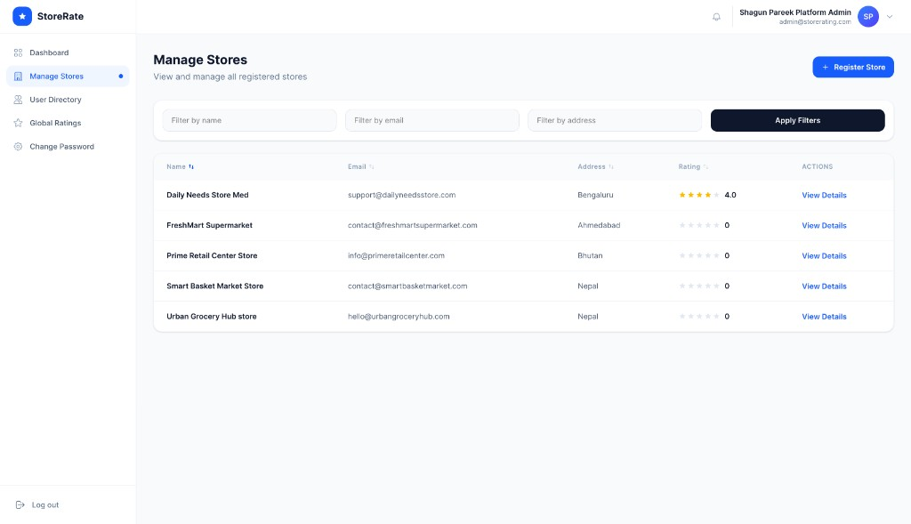
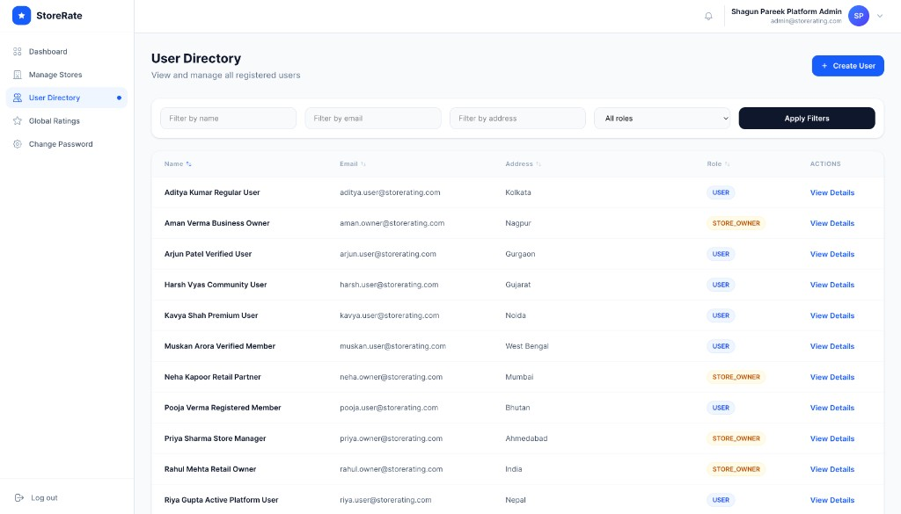
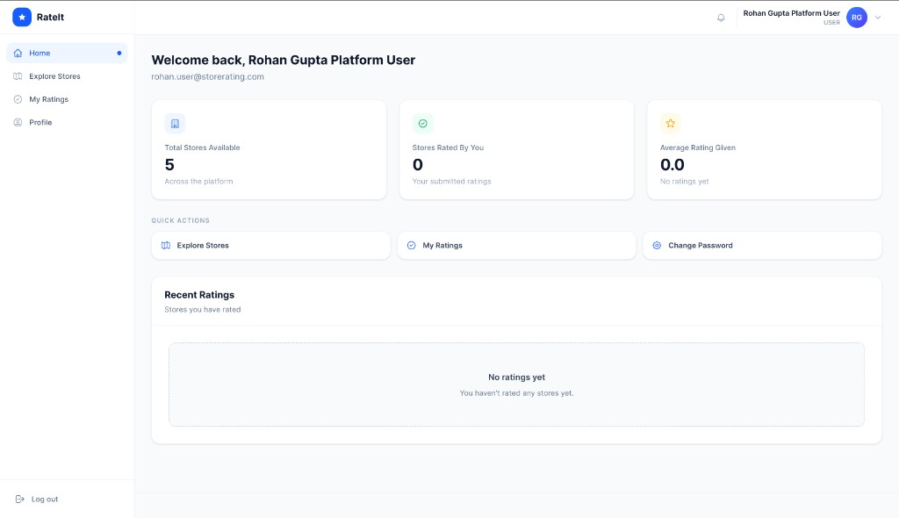
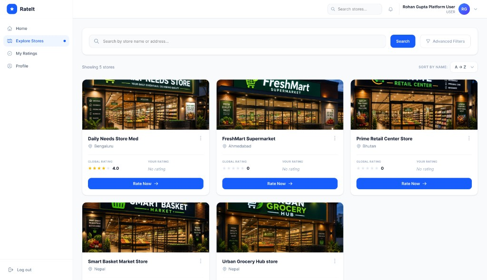
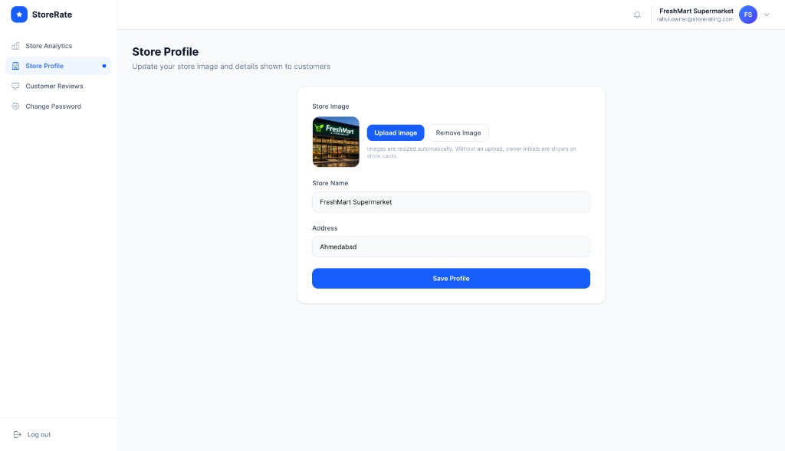

# Store Rating Platform

A full-stack store review app with role-based access for admins, customers, and store owners. Users can browse stores, submit 1–5 star ratings, and manage accounts from a single login.

| Layer      | Technology                                      |
| ---------- | ----------------------------------------------- |
| Frontend   | React 19, TypeScript, Vite, Tailwind CSS v4     |
| Backend    | Express.js 5, Node.js                           |
| Database   | PostgreSQL                                      |
| ORM        | Prisma 7                                        |
| Auth       | JWT + bcrypt                                    |

---

## Live Demo

| Service         | URL |
| --------------- | --- |
| **App**         | [https://store-rating-platform-mu.vercel.app](https://store-rating-platform-mu.vercel.app) |
| **API**         | [https://store-rating-platform-production.up.railway.app/api](https://store-rating-platform-production.up.railway.app/api) |
| **Source**      | [https://github.com/shagun101pareek/store-rating-platform](https://github.com/shagun101pareek/store-rating-platform) |

Sign up as a user from the login page, or contact me for admin / store-owner demo access.

---

## Features

### Admin
- Dashboard with user, store, and rating counts
- Create and manage users and stores
- Filter and sort listings by name, email, address, and role
- Global ratings overview





### User
- Sign up and browse stores
- Search by name or address, sort A–Z
- Rate stores (1–5) and update ratings later
- Personal dashboard, ratings history, and profile





### Store Owner
- View average rating and customer reviews
- Update store name, address, and photo



---

## Tech Overview

**Auth:** JWT issued on login, sent as a Bearer token on each request. Role-based middleware guards admin, user, and owner routes.

**Schema:** Users own stores (one-to-one). Ratings link a user to a store with a unique constraint per pair.

**API:** REST endpoints under `/api` for auth, admin, stores, ratings, and owner operations.

---

## Running the Project

**Backend** (Railway)

```bash
cd server && npm install && cp .env.example .env
npx prisma migrate deploy && npm start
```

| Variable | Value |
| -------- | ----- |
| `DATABASE_URL` | Neon PostgreSQL connection string |
| `JWT_SECRET` | Random secret string |
| `CORS_ORIGIN` | `https://store-rating-platform-mu.vercel.app` |

**Frontend** (Vercel)

```bash
cd client && npm install && cp .env.example .env && npm run build
```

| Variable | Value |
| -------- | ----- |
| `VITE_API_URL` | `https://store-rating-platform-production.up.railway.app/api` |

**Database:** PostgreSQL on [Neon](https://neon.tech). Run `npx prisma migrate deploy` before first deploy.

---

## Project Structure

```
store-rating-platform/
├── client/          # React frontend
├── server/          # Express API + Prisma
└── docs/screenshots/
```
